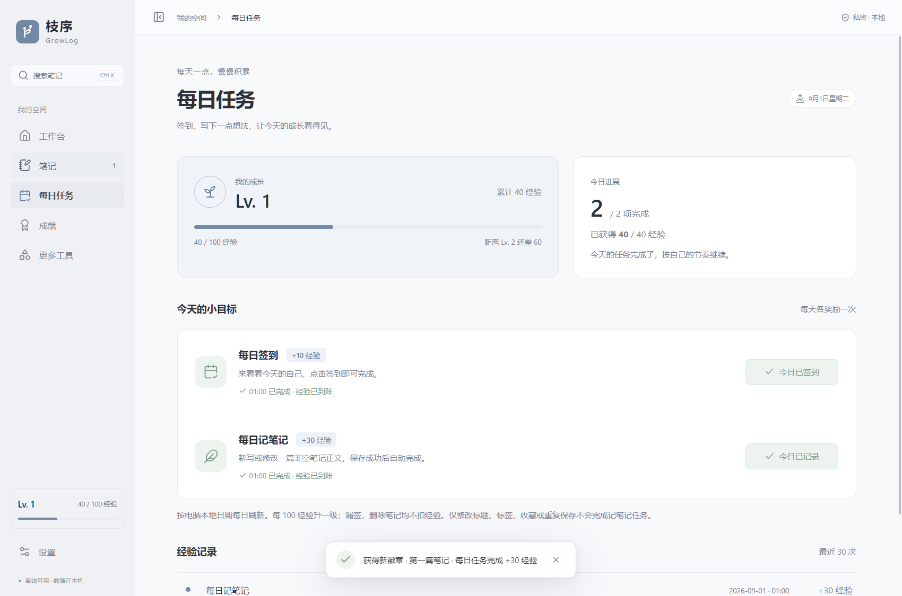

# GrowLog 枝序

本地优先的个人工具箱：Markdown 笔记、成就徽章、每日任务与等级成长。没有账号、AI、服务器或遥测。



## 下载

Windows 10/11 x64 用户可从 [GitHub Releases](https://github.com/XiaoTianbai520/GrowLog/releases) 下载最新版。推荐使用 `GrowLog-0.2.0-Setup.exe`；它包含 WebView2 离线组件，安装后无需配置开发环境。安装器尚未签名，Windows 可能显示发布者或信誉提示。

## 当前功能（0.2.0）

- Markdown 编辑 / 分栏预览 / 阅读，支持图片粘贴与文件插入。
- 文件夹、标签、中文搜索、收藏、回收站，800 毫秒自动保存。
- 内置笔记里程碑，自定义自动目标、一次完成和累计进度成就。
- 工作台、成就时间记录、浅色 / 深色 / 跟随系统主题。
- 每日签到、每日记笔记任务，自动累计经验、等级进度和经验记录。
- 每个使用日自动备份，保留最近 7 份；完整 `.zhixu` 导出和恢复。
- Windows 桌面应用，提供附带 WebView2 离线组件的中文 NSIS Setup。

## 普通使用

先保存并退出旧版，再运行 Setup，安装后从桌面快捷方式打开，不需要 Node.js、Rust、数据库或任何开发环境。0.1.0 的本机安装、覆盖安装、卸载保留数据及重装已验证；0.2.0 的功能与升级验证见 [更新说明](docs/v0.2.0.md)。

默认程序位置为 `%LOCALAPPDATA%/Programs/枝序/`。程序目录不可使用 EFS 加密目录，否则 NSIS 卸载器可能无法启动；安装器会提前检查并提示重新选择位置，不更改文件夹加密设置。独立的笔记数据目录不受此限制。

Setup 内含微软签名验证通过的完整 WebView2 x64 离线运行库。本机已有 WebView2，尚未在“干净系统且没有 WebView2”的虚拟机里断网验收；完整状态见 [验证记录](docs/validation.md)。Release 同时提供 `SHA256SUMS.txt` 用于校验。

Release 另附独立运行版本，需要电脑已有 WebView2；普通安装优先使用 Setup。

数据位于 `%APPDATA%/app.growlog.desktop/`，与安装文件分开。设置页可查看准确位置。卸载默认保留数据；覆盖安装后会进行版本检查和必要迁移。

第一次启动没有示例笔记或虚假成就。创建并写成第一篇笔记后，会获得第一枚徽章。

## 操作

| 操作 | 快捷键 |
| --- | --- |
| 新建笔记 | Ctrl + N |
| 立即保存 | Ctrl + S |
| 搜索笔记 | Ctrl + K |
| 关闭弹窗 | Esc |

笔记标题可以留空。标签输入后按 Enter，可用逗号分隔多个标签。图片支持 PNG、JPEG、GIF、WebP，单张不超过 20 MB；单篇 Markdown 不超过 5 MB。外部图片链接不自动加载，原始 HTML 不执行。预览中的勾选项只读，在 Markdown 源码中修改。

成就只在正文首次非空且成功保存时计入笔记数量；编辑、回收站恢复不会重复计数。删除笔记不会扣除已有成长记录。自定义成就修改名称或描述会保留进度，修改目标或完成方式会重置该目标。

## 每日任务与等级

- 在「每日任务」栏目点击签到获得 10 经验。
- 当天新写或修改一篇非空笔记的正文，成功保存后自动获得 30 经验。空笔记、仅修改标题/标签/收藏、首尾空白和重复保存不计入。
- 两项每天各奖励一次，合计最多 40 经验；从 Lv. 1 开始，每 100 经验升一级。漏签和删除笔记不扣经验，等级不限制功能。
- 按电脑的本地日期刷新；跨日、重新聚焦窗口及进入任务页时会更新。完全离线，因此日期取自系统时钟，不做联网防作弊校验。
- 经验从 0.2.0 开始积累，旧笔记不补发。升级会先备份再迁移，笔记与成就保持不变。新版数据不能用旧版程序打开。
- 完整备份包含经验流水。恢复会回到备份当时的状态；恢复 0.1.0 备份时经验为零，恢复前会保留现有数据备份。

## 数据安全

- “已保存”只在数据库提交成功后显示；保存失败会保留当前草稿，阻止切换并提供重试。
- 正常关闭前会提交待保存内容；强制结束程序可能丢失尚未显示保存成功的最后一段输入。
- 每日备份是当天第一次运行/操作时的快照，不是每次编辑的历史版本。软件跨过午夜仍运行时，也会检查新的使用日。
- `.zhixu` 是包含版本清单、数据库及图片的 ZIP 归档，每个文件有 SHA-256 校验。**未加密**，请妥善保存。
- V1 完整备份的数据总量上限为 2 GB，最多 99999 个数据文件；超过上限时会明确报错，不导出无法恢复的归档。
- 恢复先验证版本、文件路径、哈希和 SQLite 完整性，再生成恢复前备份并切换数据目录。拒绝较新版本或损坏备份。
- 自动备份和恢复前备份在同一磁盘，不能防止磁盘故障；建议定期导出至其他设备。
- 删除文件夹不会删除笔记；永久删除笔记后保留可能仍被其他笔记引用的图片文件，备份也不会自动清除。

## 开发与构建

以下仅供修改软件源码的开发者使用，普通用户不需要执行。

需要 Node.js、Rust MSVC 工具链、Visual Studio C++ Build Tools 和 Windows SDK。本项目开发工具可放在忽略的 `.tools/` 目录，脚本会优先使用其中的 Rust，不修改系统 PATH。

```powershell
npm ci
# 桌面开发
./scripts/desktop.ps1 -Action dev
# 前端构建与保存队列测试
npm run build
npm test
# SQLite、迁移、成就与备份测试
./scripts/desktop.ps1 -Action test
# 完整离线安装包（需能够下载官方构建组件）
./scripts/desktop.ps1 -Action build
```

版本固定于 `package-lock.json` 和 `src-tauri/Cargo.lock`。打包工具缓存位于 `src-tauri/target/.tauri/`。首版未购买 Windows 代码签名证书，可能出现发布者/信誉提示，不需要关闭系统安全防护。

`npm run dev` 仅启动前端开发服务；由于数据服务属于桌面程序，直接用浏览器打开会显示桌面启动提示，不会偷偷使用模拟数据或 localStorage。

## 项目结构与扩展

- `src/pages/`：工作台、笔记、每日任务、成就、设置和扩展说明页面。
- `src/modules.ts`：导航模块注册表；新增可用工具后再注册路由。
- `src/lib/note-session.ts`：防抖、顺序保存、修订号、失败重试及输入法状态。
- `src/api.ts` / `src/types.ts`：有类型的本地 IPC 接口。
- `src-tauri/src/store.rs`：SQLite 事务、成就指标与附件管理。
- `src-tauri/src/growth.rs` / `migration_v2.sql`：每日奖励、经验流水、等级计算与数据库版本 2 迁移。
- `src-tauri/src/backup.rs`：完整备份、校验与恢复。
- `src-tauri/src/schema.sql`：V1 数据结构；未来更改通过版本迁移追加，不能直接修改旧版本数据库。

未来按真实需求添加 Todo、日程、技能树等模块；不引入插件市场、后台服务或提前抽象的规则引擎。原始长期需求保存在 `docs/00-original-requirements.md`，0.2.0 在 V1 基础上增加了每日任务和等级。

向 GitHub 提交源码和发布安装包的完整步骤见 [GitHub 提交与发布](docs/github-publish.md)。
